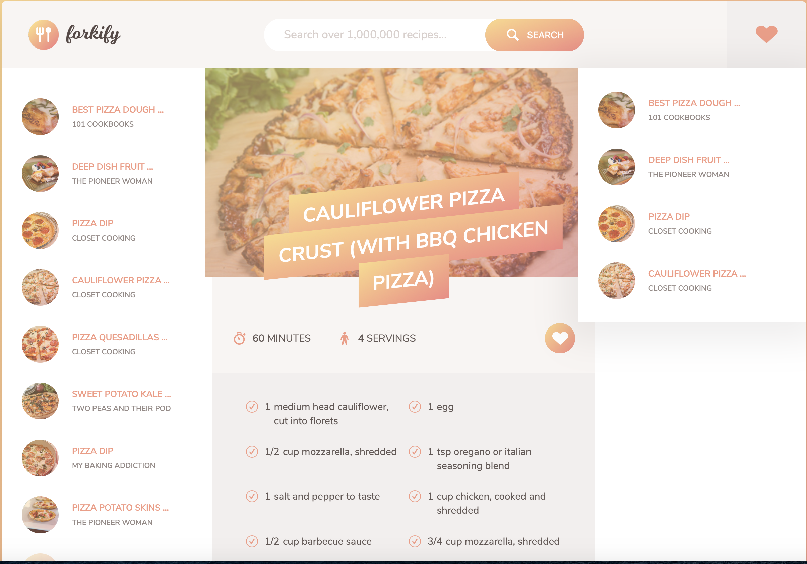

<p align="center" width="100%">
    
</p>
<h1 align="center">Forkify : The Ultimate Cooking Companion</h1>
Forkify is a JavaScript application that interacts with and API to fetch and display food recipe(s).

## Getting Started

These instructions will get you a copy of the project up and running on your local machine.

### Installing

1. Clone the repo

```
git clone https://github.com/eebadreza/forkify.git
```

2. Open Project Folder

3. Open index.html in your favorite browser

4. Explore

```
Enjoy :)
```

### App UI (Demo)


